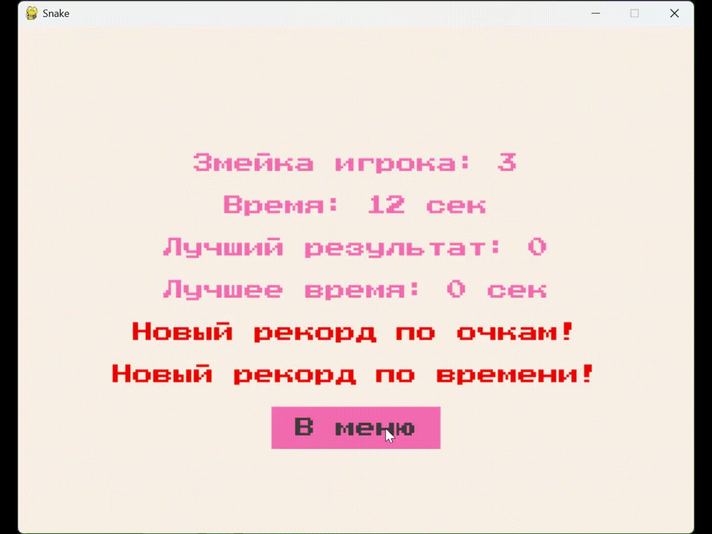

# 🐍 Snake

Классическая игра «Змейка» на Python + pygame с двумя режимами, тёмной/светлой темой, музыкой
и системой рекордов.

**🎮 Возможности**

- Два режима: **классический** и **гонка с ИИ**
- Тёмная и светлая темы
- Фоновая музыка и переключение звука
- Система рекордов (по очкам и по времени)
- Защита рекордов от подмены через SHA-256

---

## 🎬 Демо

### 🌙 Тёмная тема — гонка с ИИ


*Игрок (зелёная змейка) против ИИ (синяя). ИИ самостоятельно ищет безопасный путь к яблоку.*

### ☀️ Светлая тема — классический режим



*Одиночная игра: управление стрелками, счёт и время в реальном времени.*

---

## 🚀 Установка и запуск

### Требования

- **Python 3.10+**
- **pygame 2.6.1**

### Установка

```bash
git clone https://github.com/alex-50/Snake.git
cd Snake

# Создать виртуальное окружение (опционально)
python -m venv .venv

# Windows
.venv\Scripts\activate

# Linux / macOS
source .venv/bin/activate

# Установить зависимости
pip install -r requirements.txt
```

### Запуск

```bash
python main.py
```

Игра запускается из любой директории — пути к ресурсам определяются автоматически.

---

## 🎮 Управление

| Клавиша | Действие |
|---|---|
| ↑ ↓ ← → | Движение змейки |
| Закрыть окно | Выход из игры |

В меню:

- **Классический режим** — одиночная игра.
- **Гонка с ИИ** — игра против бота.
- **Звук: Вкл/Выкл** — переключение музыки.
- **Тема: Тёмная/Светлая** — переключение оформления.

---

## 🔬 Режимы игры

### Классический

Один игрок. Цель — набрать как можно больше очков, поедая яблоки.
Змейка растёт с каждым яблоком, задевать себя нельзя.

### Гонка с ИИ

Против игрока — змейка под управлением простого ИИ.
ИИ ищет **безопасное** направление к яблоку, обходя свои и чужие сегменты.
Игра заканчивается, если кто-то врезался в себя или в соперника.

---

## 🏆 Рекорды

Рекорды сохраняются в `records.json` и **подписываются SHA-256**.
Если файл отредактирован вручную (хеш не сходится) — рекорды обнуляются.

Хранятся:

- **Лучший счёт** для каждого режима.
- **Лучшее время** для каждого режима.

> ⚠️ Файл `records.json` создаётся при первом запуске и **не входит в репозиторий**.

---

## 🛠 Стек

- **Python 3.10+** — язык
- **pygame 2.6.1** — игровой движок

---

## 📁 Структура проекта

```
Snake/
├── main.py                    # точка входа
├── game.py                    # Game — оркестратор (меню, цикл, экран рекордов)
├── settings.py                # константы: цвета, темы, размеры, стартовые позиции
├── records.py                 # загрузка/сохранение рекордов с SHA-256
├── utils.py                   # пути к ресурсам
│
├── objects/                   # игровые объекты
│   ├── __init__.py
│   ├── snake.py               # Snake — тело, движение, повороты
│   ├── apple.py               # Apple — генерация яблока
│   └── ai_controller.py       # AIController — логика ИИ-змейки
│
├── ui/                        # UI-элементы
│   ├── __init__.py
│   └── button.py              # Button — кликабельная кнопка
│
├── assets/                    # ресурсы
│   ├── fonts/                 # шрифт PressStart2P
│   └── sounds/                # mp3-мелодии
│
├── demo/                      # GIF-демо для README
├── requirements.txt
├── .gitignore
└── README.md
```

---

## 📄 Лицензия

Проект создан в учебных целях. Используйте свободно.